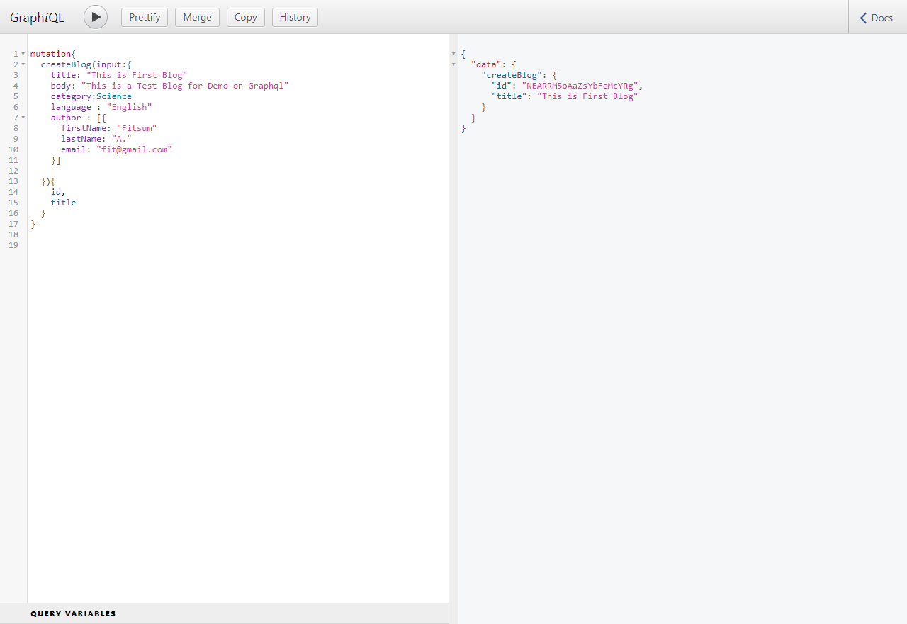
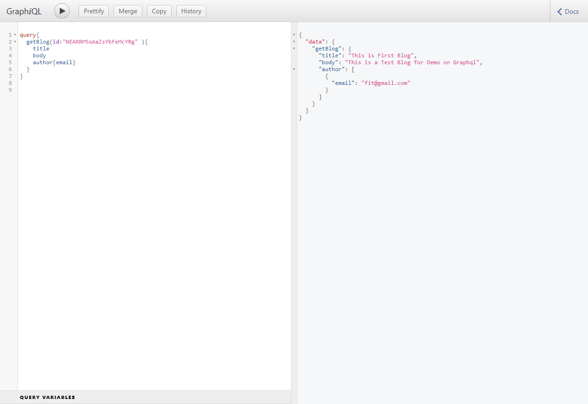

# Blog Graphql 
A Demo on graphql Using fake Blog Database 

## Required Node Modules  : 
*  express-graphql
*  express   
*  graphql 
*  nanoid

## To Run the  : use  localhost:3000/graphql route 

## Create New Blog 

## View Blogs 
